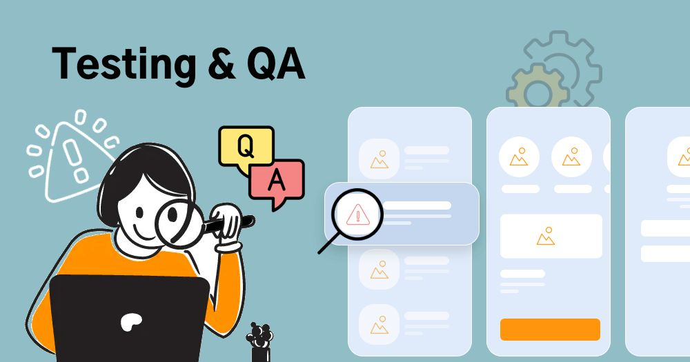

## I. Apa Itu Unit Testing?

Unit Testing adalah jenis pengujian perangkat lunak yang berfokus pada pengujian unit-unit terkecil (isolated units) dalam sebuah sistem. Unit terkecil ini biasanya mencakup pengujian function, method, dan class.

- **Unit testing** adalah pengujian paling awal dan berada di dasar Piramida Pengujian.
- **Fokus**: Menguji komponen secara independen tanpa bergantung pada sistem lain.
- **Analogi**: Mengecek setiap komponen mobil (mesin, rem, lampu) secara terpisah sebelum dirakit menjadi mobil utuh. Jika setiap komponen lulus tes, masalah pada mobil rakitan dapat dipastikan bukan berasal dari komponen dasar.

## II. Mengapa Unit Testing Penting?

Unit testing adalah praktik vital yang membantu memastikan keandalan, kualitas, dan kemudahan pemeliharaan kode yang kita tulis.

- **Mendeteksi Bug Lebih Awal**: Menemukan cacat pada fungsi spesifik segera setelah dikembangkan, yang jauh lebih murah dan cepat untuk diperbaiki.
- **Mempermudah Perubahan dan Refactoring**: Memberikan jaring pengaman. Ketika pengembang melakukan refactoring (perubahan struktur kode tanpa mengubah fungsionalitas), unit test yang ada akan segera memberi tahu jika perubahan tersebut merusak fungsi lain.
- **Meningkatkan Kualitas Kode**: Memaksa pengembang untuk menulis kode yang testable (dapat diuji), yang secara alami mengarah pada kode yang lebih modular dan berkualitas tinggi.
- **Memberikan Dokumentasi Kode yang Hidup**: Unit test berfungsi sebagai dokumentasi yang selalu up-to-date. Pengembang baru dapat melihat test case untuk memahami bagaimana suatu fungsi seharusnya bekerja.
- **Menghemat Waktu dan Biaya**: Memperbaiki bug di lingkungan produksi jauh lebih mahal daripada memperbaikinya di tahap pengembangan.
- **Meningkatkan Kepercayaan Diri**: Pengembang memiliki kepercayaan diri yang tinggi untuk melakukan perubahan besar karena mereka tahu bahwa tes otomatis akan mendeteksi regresi.

## III. Pola Dasar: Arrange, Act, Assert (AAA)

Pendekatan populer dalam penulisan unit test adalah **Arrange, Act, Assert (AAA)**. Pola ini membagi setiap test case menjadi tiga bagian yang jelas:

1. **Arrange (Menyiapkan)**:
   - **Tujuan**: Menyiapkan kondisi awal tes.
   - **Tindakan**: Mendeklarasikan variabel, menginisialisasi objek, dan menyiapkan data input yang dibutuhkan.

2. **Act (Melakukan Aksi)**:
   - **Tujuan**: Menjalankan fungsi atau metode yang akan diuji.
   - **Tindakan**: Memanggil fungsi yang ingin diverifikasi dan menyimpan hasilnya.

3. **Assert (Memverifikasi)**:
   - **Tujuan**: Memverifikasi bahwa hasil dari tindakan yang dilakukan sesuai dengan ekspektasi.
   - **Tindakan**: Menggunakan fungsi assertion (e.g., `assertEquals`, `assertTrue`) untuk membandingkan Actual Result dengan Expected Result.

## IV. Pengenalan Framework Unit Testing Populer

Ada banyak framework yang mendukung unit testing di berbagai bahasa pemrograman:

| Framework | Bahasa       | Kapan Digunakan?                              | Keunggulan                                                                 |
|-----------|--------------|-----------------------------------------------|----------------------------------------------------------------------------|
| JUNIT 5   | Java         | Bekerja dengan Java atau bahasa berbasis JVM (Kotlin, Scala). | Framework de facto, integrasi penuh dengan IDE, struktur berbasis Anotasi. |
| JEST      | JavaScript   | Menggunakan React, Node.js, atau framework frontend modern lainnya. | Konfigurasi Minimal (Zero-Config), Batteries-Included, Fitur Snapshot Testing (membandingkan tampilan UI). |
| PYTEST    | Python       | Proyek Python apapun (skrip sederhana, web, data science, API). | Sintaks Sederhana & Boilerplate Rendah, Fixtures yang Sangat Kuat, Pelaporan Error yang Detail. |

## V. Kesimpulan

Unit Testing adalah fondasi dari Software Development Life Cycle (SDLC) yang sehat. Dengan mengadopsi pola AAA dan memanfaatkan framework yang kuat, pengembang dapat mendeteksi bug di sumbernya, menghasilkan kode yang lebih andal, dan mempercepat proses maintenance proyek secara keseluruhan.