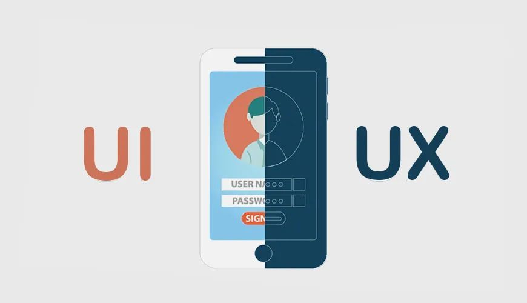

Kali ini, kita akan membahas topik penting lainnya dalam dunia pengujian perangkat lunak: UI/UX Testing (Pengujian Antarmuka Pengguna dan Pengalaman Pengguna). Pengujian ini berfokus pada bagaimana pengguna berinteraksi dan merasakan sebuah aplikasi.

## I. Perbedaan Mendasar antara UI Testing dan UX Testing

Meskipun sering digabungkan, UI dan UX Testing memiliki fokus yang berbeda:

### UI Testing (User Interface Testing)
- Fokus: Tampilan antarmuka aplikasi—warna, ikon, ukuran tombol, layout, konsistensi, dan responsivitas.
- Tujuan: Memastikan bahwa tampilan disajikan dengan benar dan konsisten di berbagai perangkat.
- Contoh Pengujian: Memastikan tombol "Login" muncul di posisi yang benar atau ukuran font terbaca dengan baik di mobile maupun desktop.

### UX Testing (User Experience Testing)
- Fokus: Pengalaman pengguna secara keseluruhan saat menggunakan aplikasi.
- Tujuan: Menguji apakah pengguna dapat mencapai tujuan mereka dengan mudah, efektif, dan merasa puas.
- Contoh Pengujian: Menguji apakah pengguna bisa menemukan produk dan menyelesaikan pembelian dengan mudah tanpa merasa bingung.

## II. Fokus Utama UI Testing

Pengujian UI memastikan aspek visual dan teknis antarmuka berfungsi sempurna.

- Konsistensi Visual: Semua halaman harus memiliki gaya seragam (warna, ikon, font, ukuran tombol) di seluruh aplikasi.
  - Contoh tools: Automated visual regression testing seperti Percy atau Applitools.
- Responsivitas: Desain harus tetap nyaman dipakai di berbagai ukuran layar (desktop, tablet, smartphone).
  - Contoh tools: Automated testing menggunakan BrowserStack atau Lambda Test.
- Kompatibilitas: UI harus bekerja dengan baik di berbagai browser (Chrome, Firefox, Safari, Edge) dan sistem operasi (Windows, macOS, Android, iOS).
  - Contoh tools: Cross-browser testing seperti BrowserStack atau Sauce Labs.

## III. Fokus Utama UX Testing

Pengujian UX adalah proses iteratif yang berfokus pada tiga pilar utama: Alur Kerja, Kegunaan, dan Aksesibilitas.

### 1. Alur Kerja (Workflow)
Alur kerja UX testing adalah proses iteratif yang dimulai dari perencanaan (menentukan tujuan dan peserta), rekrutmen pengguna, pelaksanaan sesi uji (observasi dan wawancara), analisis data, hingga iterasi desain.

### 2. Kegunaan (Usability)
Kegunaan mengacu pada seberapa mudah dan efektif pengguna dapat berinteraksi dengan perangkat lunak.
- Usability Testing: Melibatkan pengguna nyata dalam tugas-tugas spesifik sambil mengamati kesulitan mereka. Manfaatnya adalah mengidentifikasi cacat desain awal dan meningkatkan kepuasan pengguna.

### 3. Aksesibilitas (Accessibility Testing)
Aspek UX yang memastikan perangkat lunak dapat digunakan oleh semua orang, termasuk penyandang disabilitas (gangguan penglihatan, pendengaran, atau motorik).
- Fokus: Evaluasi terhadap standar WCAG (Web Content Accessibility Guidelines), termasuk penggunaan screen reader, navigasi keyboard, dan kontras warna.

## IV. Metode dan Tools UI/UX Testing

Berbagai metode digunakan untuk mengukur efektivitas UI/UX:

- Manual Testing: Dilakukan langsung oleh QA tester atau pengguna, fokus pada pengecekan tampilan (UI) dan alur interaksi (UX) secara step-by-step.
  - Contoh tools: Checklist, Prototype, Figma.
- A/B Testing: Membandingkan dua versi desain (A dan B) untuk melihat mana yang memiliki kinerja lebih baik (misalnya tingkat konversi 46% vs 21%).
- Heatmaps: Visualisasi area yang paling sering di-klik atau diperhatikan pengguna.
  - Contoh tools: Hotjar, Crazy Egg, Microsoft Clarity.
- Heuristic Evaluation (10 Prinsip Usabilitas Jakob Nielsen):
  1. Visibilitas Status Sistem.
  2. Kecocokan Antara Sistem dan Dunia Nyata.
  3. Kontrol dan Kebebasan Pengguna ("Pintu Darurat").
  4. Konsistensi dan Standar.
  5. Pencegahan Kesalahan.
  6. Mengenali daripada Mengingat.
  7. Fleksibilitas dan Efisiensi Penggunaan (Jalan pintas bagi pengguna ahli).
  8. Desain Estetis dan Minimalis.
  9. Bantuan Pengguna Mengenali, Mendiagnosis, dan Memulihkan Diri dari Kesalahan (Pesan error yang jelas).
  10. Bantuan dan Dokumentasi.

## V. Kesimpulan

Pengujian UI/UX adalah proses yang saling melengkapi. UI memastikan produk terlihat benar dan berfungsi secara visual, sementara UX memastikan produk berfungsi dengan mudah dan memuaskan bagi pengguna akhir. Keduanya krusial untuk menghasilkan software yang sukses.