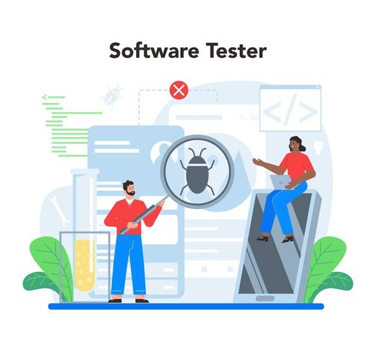

## I. Overview: Elemen-Elemen Pengujian Perangkat Lunak

Test Scenario, Test Case, dan Bug Report adalah tiga elemen yang saling melengkapi dalam proses pengujian perangkat lunak. Ketiganya bekerja secara berurutan untuk memastikan aplikasi berjalan sesuai harapan dan bebas dari kesalahan.

- **Test Scenario**: Gambaran umum apa yang diuji (fokus pada fungsi aplikasi).
- **Test Case**: Langkah detail bagaimana pengujian dilakukan (input, proses, hasil yang diharapkan).
- **Bug Report**: Laporan formal kesalahan/masalah pada sistem.

## II. Test Scenario (TS)

Test Scenario adalah gambaran umum (skenario) tingkat tinggi mengenai fungsi yang perlu divalidasi. Ini menjawab pertanyaan "APA yang harus diuji?"

### Template Sederhana Test Scenario

| Field          | Keterangan                                      |
|-----------------|------------------------------------------------|
| ID Scenario     | Nomor unik skenario (e.g., TS001)              |
| Deskripsi       | Ringkasan skenario pengujian                   |
| Modul/Fitur     | Modul atau fitur yang diuji                    |

### Contoh Test Scenario (Aplikasi BMI)

| ID Scenario | Deskripsi                          | Modul/Fitur yang diuji         |
|-------------|------------------------------------|---------------------------------|
| TS001       | Periksa fungsi slider input        | Slider input berat dan tinggi badan |
| TS002       | Periksa hasil perhitungan dan klasifikasi BMI | Perhitungan dan klasifikasi BMI |
| TS003       | Periksa fungsi penyimpanan history BMI | History BMI                    |

## III. Test Case (TC)

Test Case adalah sekumpulan langkah detail, kondisi awal, dan data yang digunakan untuk memverifikasi fungsionalitas tertentu. Ini menjawab pertanyaan "BAGAIMANA pengujian dilakukan?"

### Template Sederhana Test Case

| Field          | Keterangan                                      |
|-----------------|------------------------------------------------|
| ID Test Case    | Nomor unik test case (e.g., TC001)             |
| Deskripsi       | Ringkasan singkat tentang pengujian            |
| Precondition    | Kondisi awal sebelum pengujian                 |
| Test Steps      | Langkah-langkah detail pengujian               |
| Test Data       | Data yang digunakan untuk pengujian            |
| Expected Result | Hasil yang diharapkan sesuai requirement       |
| Actual Result   | Hasil aktual yang muncul setelah pengujian     |
| Status          | Lulus/Gagal (Pass/Fail)                        |

### Contoh Test Case (Aplikasi BMI - TS002)

| ID Test Case | Deskripsi                          | Test Data                     | Expected Result               |
|--------------|------------------------------------|-------------------------------|-------------------------------|
| TC003        | Verifikasi hasil perhitungan BMI  | Tinggi = 170cm, Berat = 65kg  | Hasil BMI = 22.49 (Sesuai rumus standar) |
| TC004        | Verifikasi Kategori Underweight   | Tinggi = 170cm, Berat = 45kg  | BMI = 15.6, Kategori "Underweight" |
| TC005        | Verifikasi Kategori Normal        | Tinggi = 165cm, Berat = 60kg  | BMI $\approx$ 25.95, Kategori "Normal" |

## IV. Bug Report

Bug Report adalah laporan formal yang mendokumentasikan setiap kesalahan atau masalah yang ditemukan selama pengujian. Laporan yang baik harus ringkas, jelas, dan dapat direproduksi.

### Elemen Bug Report Kunci

- **Bug Title & ID**: Judul singkat dan ID unik.
- **Severity (Tingkat Keparahan)**: Mengukur dampak bug pada fungsi software.
- **Priority (Prioritas)**: Mengukur urgensi perbaikan bug.
- **Step to Reproduce**: Langkah-langkah yang diperlukan untuk memunculkan bug kembali.
- **Actual Result**: Hasil yang muncul saat tester melakukan test case.
- **Expected Result**: Hasil yang seharusnya muncul (berdasarkan spesifikasi).

### Klasifikasi Severity dan Priority

| Severity (Dampak)       | Priority (Urgency)                     |
|--------------------------|----------------------------------------|
| Critical: Kegagalan total sistem atau fungsionalitas utama. | P1 - Urgent/Critical: Harus segera diperbaiki. |
| Major (High): Fungsionalitas utama tidak bekerja dengan benar. | P2 - High: Penting, harus diperbaiki secepatnya karena memengaruhi pengguna. |
| Minor (Medium): Tidak memengaruhi fungsionalitas utama, hanya ketidaknyamanan. | P3 - Medium: Bisa diperbaiki di siklus rilis berikutnya. |
| Low: Bug minor atau kosmetik. | P4 - Low: Bisa diperbaiki kapan saja. |

### Contoh Bug Report (Aplikasi BMI)

| Field          | Detail                                         |
|-----------------|-----------------------------------------------|
| Bug Title       | Perhitungan BMI salah saat input berat 60kg dan tinggi 170cm |
| Bug ID          | BMI-001                                       |
| Step to Reproduce | 1. Buka aplikasi BMI 2. Masukkan Berat = 60 3. Masukkan Tinggi = 170 4. Klik tombol "Hitung" |
| Actual Result   | Hasil BMI = 12.5                              |
| Expected Result | Hasil BMI seharusnya = 20.8                   |
| Severity        | Major (High)                                  |
| Priority        | P2 - High                                     |
| Assignee        | Developer                                     |

## V. Cara Menghindari Bug

Pencegahan bug harus diterapkan di seluruh siklus pengembangan, bukan hanya saat pengujian:
- **Pahami Persyaratan**: Pastikan semua persyaratan dipahami dengan jelas oleh seluruh tim.
- **Unit Testing**: Deteksi bug di tahap awal pengembangan (pengujian kode individual).
- **Code Review**: Minta pengembang lain meninjau kode.
- **Rencana Pengujian**: Buat Test Plan yang komprehensif.
- **Pengujian Otomatis**: Manfaatkan automation testing untuk deteksi bug yang lebih cepat.
- **Kolaborasi Tim**: Tingkatkan komunikasi antara pengembang dan penguji.